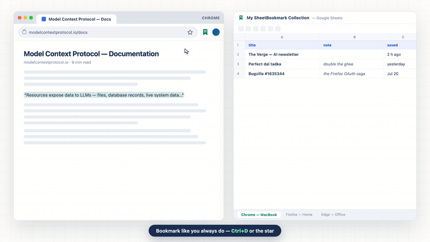

# SheetBookmark — sync bookmarks across Chrome, Firefox & Edge into a Google Sheet you own

**Bookmark normally. It lands in your own spreadsheet within seconds — from every browser, searchable in every browser. No server, no account, no tracking.**

  

 · [Website](https://shuckz77.github.io/sheetbookmark/) · [Privacy](https://shuckz77.github.io/sheetbookmark/PRIVACY.html)

## What it does

- 📑 **One Google Sheet, a tab per browser** — Chrome, Firefox, Edge, Brave, Vivaldi each write to their own tab; nothing overlaps, rename anything freely
- ⚡ **Instant sync** — `Ctrl/Cmd+D` or one click, row appears in seconds (or batch every 15 min / hour / day / manual)
- 🔎 **Search everything from anywhere** — the popup shows the union of all browsers' bookmarks
- ✍️ **Notes on every bookmark** — pre-filled from your highlighted text; edit any row's note later with its ✎, from any browser
- 🔁 **Two-way** — pull your other browsers' bookmarks into this one (additive, never deletes)
- 🪶 **Feather-light** — no content scripts, no background polling, zero idle wakeups

## Why a spreadsheet?

Because you own it. Sort, filter, add columns, export, grep — your bookmarks are a normal file in **your** Drive, not rows in someone's database. The extension uses Google's narrow `drive.file` scope: it *cannot* see anything in your Drive except the one sheet it creates.

## Get it

- 🏬 Chrome Web Store / Firefox Add-ons / Edge Add-ons — **coming soon**
- 🔧 From source (2 min): clone → `npm run build` → load `dist/chrome` unpacked (or `dist/firefox` via `about:debugging`) → details in [guides/DEVELOPMENT.md](guides/DEVELOPMENT.md)

## How do I sync bookmarks between Chrome and Firefox?

1. Install SheetBookmark in both browsers
2. Click **Connect Google Sheets** in each (same Google account)
3. Done — each browser finds the shared sheet and adds its own tab; bookmark as you always did

## FAQ

**Does it work across computers?** Yes — the sheet lives in your Drive; any install on the same Google account joins it.

**Can it read my passwords or history?** No. Browsers expose no password API to extensions, and SheetBookmark requests no history permission. It reads a page only at the moment you save it.

**What if I rename the sheet, or delete a row?** Rename/move anything — sync follows the file, not the name. Deleting a row makes that page saveable again.

**What does it cost?** Nothing, for everyone, forever. Licensed **AGPL-3.0**: build on it freely — and share your improvements openly, with attribution. Improvements belong [here](CONTRIBUTING.md), not in closed copies.

## Honest limitations

- Deletions don't propagate to browsers — the sheet is an append-friendly log (deleting a *row* is how you "unsave")
- Only bookmark *creation* is captured, not later edits to native bookmarks
- Sign-in renews silently but needs one click if you're logged out of Google in that browser

---

Made for people who live in more than one browser. [Contribute](CONTRIBUTING.md) · [Report a problem](https://github.com/ShuckZ77/sheetbookmark/issues/new) · [Development guide](guides/DEVELOPMENT.md) · AGPL-3.0 © ShuckZ77
